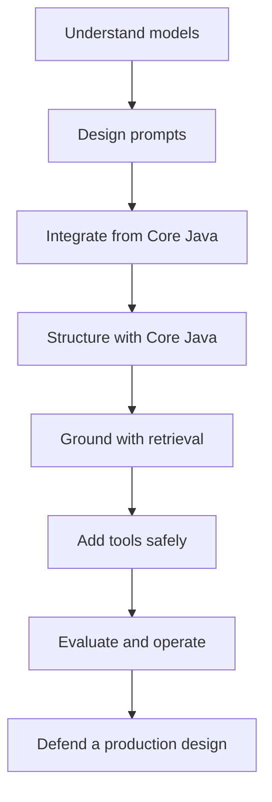

# Generative AI for Java Freshers — 10-Day Reference Curriculum

> A concept-first, trainer-ready repository for Java 21, Maven, Core Java, standard HTTP, and OpenAI integration patterns—without Spring.

## Purpose

This repository is classroom reference material, not an executable sample project. It teaches how Generative AI systems work and how Java applications are designed around them. The Java, Maven, configuration, JSON, and API fragments are intentionally incomplete. Learners must reason about, adapt, and complete them during guided activities.

## Audience

- Java freshers who know variables, control flow, classes, interfaces, exceptions, collections, and basic HTTP/JSON ideas
- Trainers conducting a two-week, 10-working-day course
- Teams onboarding junior Java developers into GenAI projects

## Technology baseline

| Area | Curriculum baseline |
| --- | --- |
| Language | Java 21 |
| Build | Maven 3.6.3+ concepts and lifecycle |
| Core integration | Java HTTP client and official OpenAI Java SDK patterns |
| HTTP integration | Java 21 `HttpClient` concepts |
| AI client | Official OpenAI Java SDK reference patterns |
| Concrete provider | OpenAI, with provider-neutral design guidance |
| Diagrams | Mermaid rendered by GitHub |

Versions are a dated learning baseline, not a promise of permanent compatibility. See [Version Policy](resources/version-policy.md) before updating any dependency.

## Explicit non-goals

- No runnable `main` class, web framework, or complete application
- No API keys, real secrets, or `.env` files
- No copied production solution for assignments
- No Spring, Jakarta framework, dependency-injection container, or annotation-driven web layer
- No claim that model output is always factual, deterministic, safe, or current

## 10-day roadmap

| Day | Theme | Core Java/Maven focus | Main learner artifact |
| --- | --- | --- | --- |
| 1 | GenAI foundations | Java 21 records, sealed interfaces, Maven mental model | Use-case canvas |
| 2 | LLM mechanics | Token budgets, immutable request models, concurrency choices | Request-envelope design |
| 3 | Prompt engineering | Text blocks, templates, structured output DTOs | Prompt specification |
| 4 | Core Java integration | HTTP, SDK boundaries, exceptions, retries, secrets | Provider adapter design |
| 5 | Core Java application architecture | composition root, services, ports, adapters, configuration | Layered application blueprint |
| 6 | Embeddings and vector search | Similarity, chunk records, vector-store ports | Semantic search design |
| 7 | Retrieval-Augmented Generation | Ingestion and query pipelines, grounding, citations | RAG architecture |
| 8 | Tools and agentic workflows | Function contracts, state machines, virtual threads | Safe workflow design |
| 9 | Safety, evaluation, observability | Guardrails, test sets, metrics, cost and latency | Evaluation plan |
| 10 | Production design and interviews | Capstone architecture, ADRs, review rubric | Design presentation |

Each day assumes six contact hours: 3 hours of guided explanation, 1.5 hours of analysis activities, 1 hour of assignment work, and 30 minutes of assessment/reflection.

## How to navigate

1. Start with the [course syllabus](docs/course-guide/syllabus.md).
2. Read the daily `README.md` in order.
3. Use the day's [interview Q&A](resources/interview-question-bank.md) references for recap.
4. Complete the assignment without turning the supplied snippets into a copy-paste exercise.
5. Use the [final assessment](assessments/final-assessment.md) and [capstone rubric](resources/capstone-rubric.md) on Day 10.

## Repository map

```text
.
├── README.md
├── docs/course-guide/       # syllabus, outcomes, trainer and assessment guidance
├── days/day-01 ... day-10/  # daily lesson, interview Q&A, assignment
├── resources/               # glossary, patterns, checklists, banks and references
├── assessments/             # diagnostic, daily quizzes and final assessment
└── templates/               # reusable learner worksheets
```

## Learning progression



## Snippet legend

Every fragment uses one of these labels:

- **Concept fragment** — illustrates a language or design idea; not compilable as shown.
- **Boundary sketch** — shows interfaces between layers; implementations are omitted.
- **Configuration excerpt** — only the relevant Maven/YAML lines; not a full file.
- **Anti-pattern** — deliberately flawed code for review.

## Suggested evaluation weights

| Component | Weight |
| --- | ---: |
| Daily knowledge checks | 15% |
| Daily assignments | 30% |
| Prompt and evaluation portfolio | 15% |
| Capstone architecture | 30% |
| Final interview/viva | 10% |

## Responsible-use position

Learners must treat model output as untrusted input. Human review, least privilege, privacy controls, evaluation, source attribution, and failure handling are part of the functional design—not optional production polish.

## License

Educational text and diagrams are provided under the [Creative Commons Attribution 4.0 International License](LICENSE). Adapt the material for internal training with attribution.
