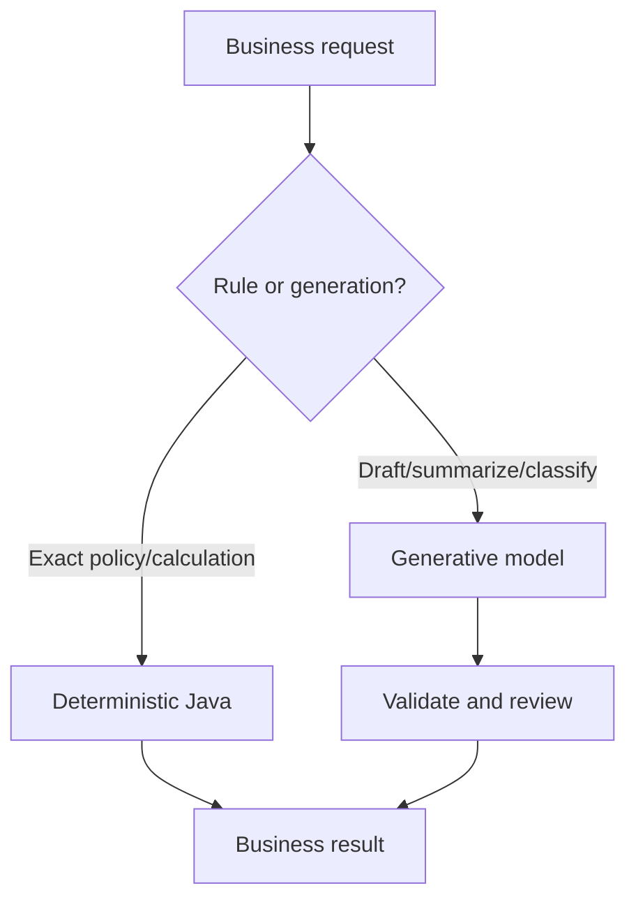
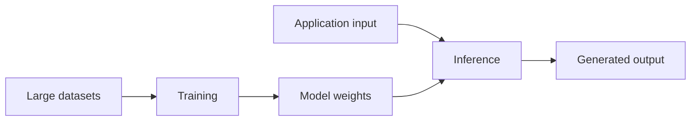
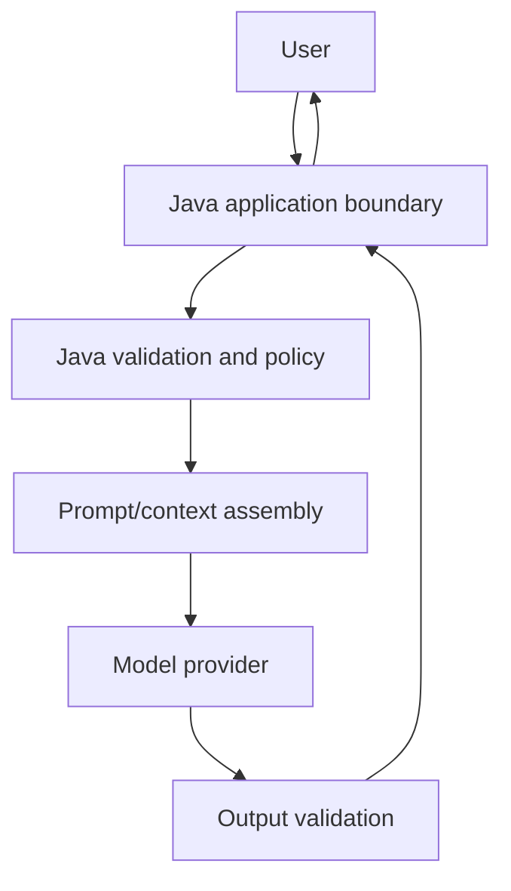

# Day 1 — Generative AI Foundations and the Java Developer’s Role

## Outcomes

Learners can distinguish AI, ML, deep learning, and Generative AI; explain the application lifecycle; identify suitable and unsuitable use cases; and map Java 21/Maven responsibilities around a model.

## 1. The important distinction

Traditional Java code follows explicit logic. Given the same state and input, it is expected to produce the same result. A generative model estimates likely output tokens from patterns learned during training. It can be useful without being deterministic or guaranteed correct.



A robust system combines both. Java owns authentication, authorization, validation, persistence, transactions, rules, monitoring, and integration. The model contributes language or multimodal inference inside a bounded task.

## 2. Taxonomy

- **AI** is the broad discipline.
- **Machine learning** learns patterns from data.
- **Deep learning** uses multilayer neural networks.
- **Generative AI** produces new content from learned patterns.
- **LLMs** are generative models specialized in language/token sequences.

Do not describe every GenAI application as an “agent.” A single request that summarizes text is a model call. An agentic system adds iterative decisions, tools, state, or planning.

## 3. Training versus inference



Most Java application developers integrate at inference time. They usually do not train foundation models. RAG and prompt engineering also operate primarily around inference; fine-tuning changes model behavior through additional training.

## 4. Where Java 21 fits

```java
// Concept fragment
record AiUseCase(
        String name,
        RiskLevel risk,
        boolean requiresCurrentKnowledge,
        boolean requiresExactCalculation,
        boolean hasHumanReviewer) {
}
```

This record captures decision inputs. It does not decide suitability by itself.

```java
// Concept fragment
sealed interface ProcessingStrategy
        permits DeterministicRule, ModelAssisted, HumanOnly { }
```

The model-assisted path should be selected only when language inference adds value and errors can be bounded.

## 5. Use-case filter

Ask these questions in order:

1. What user decision or task improves?
2. Is the output generative, or can normal rules/search solve it?
3. What is the cost of a plausible but wrong answer?
4. Is authoritative context available?
5. Can output be validated or reviewed?
6. What sensitive data would leave the application boundary?
7. What latency and cost are acceptable?
8. What happens when the provider is unavailable?

Good starter cases include drafting, summarization, extraction with validation, classification with an escalation path, and question answering over approved documents. Poor first cases include unreviewed medical/legal decisions, final financial authorization, exact calculation that Java can perform, and destructive action based only on generated text.

## 6. Maven’s role

Maven manages repeatability: Java release, dependencies, tests, plugins, and packaging. It does not make model behavior repeatable. A locked dependency graph and deterministic build can still call a probabilistic service.

```xml
<!-- Configuration excerpt -->
<properties>
    <java.version>21</java.version>
    <maven.compiler.release>21</maven.compiler.release>
</properties>
```

## 7. End-to-end application view



The two validation boxes are different. Input validation protects the request boundary; output validation protects the application from malformed, unsupported, or unsafe generation.

## 8. Case study: onboarding assistant

Desired capability: answer a new employee’s questions about leave and benefits.

- Java authenticates the employee and identifies tenant/region.
- retrieval selects approved policy sections.
- the model drafts a concise answer from supplied evidence.
- citation validation ensures sources exist.
- the UI labels the answer as AI-assisted and links policies.
- uncertain cases escalate to HR.

The model does not grant leave, modify payroll, or invent policy.

## Misconception check

- GenAI is not a database.
- Prompt engineering is not model training.
- A model parameter is not a Java method parameter.
- More model capability does not remove application controls.
- Successful HTTP 200 means the call completed, not that the answer is correct.

## Recap

The central design idea is bounded assistance: use models for language inference while Java retains deterministic control over rules, data access, safety, and side effects.
