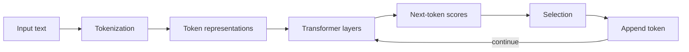

# Day 2 — How Language Models Work: Tokens, Context, Embeddings, and Inference

## Outcomes

Learners can explain a transformer at an application level, distinguish tokens from words, reason about context budgets, interpret sampling controls carefully, and model request budgets in Java 21.

## 1. Next-token generation

An LLM repeatedly estimates a probability distribution for the next token based on the preceding context, selects a token according to decoding rules, appends it, and continues until a stop condition.



This explains both fluency and fallibility: predicting likely language is not the same as consulting an authoritative fact store.

## 2. Tokens

A token may be a word, part of a word, punctuation, whitespace pattern, or other symbol depending on the tokenizer. Character count and Java `String.length()` do not equal token count.

Application consequences:

- limits are commonly expressed in tokens;
- multilingual text tokenizes differently;
- retrieved context competes with instructions, history, user input, and output;
- token usage affects latency and cost;
- truncation can remove the most important evidence if budgeting is naive.

## 3. Context window

```text
context budget = system instructions
               + conversation/history
               + user input
               + retrieved/tool context
               + reserved output
               + protocol overhead
```

The context window is not long-term memory. Applications decide what history to retain, summarize, retrieve, or discard.

```java
// Concept fragment
record TokenBudget(
        int maximumContext,
        int instructions,
        int history,
        int evidence,
        int userInput,
        int reservedOutput) {

    int remaining() {
        return maximumContext - instructions - history
                - evidence - userInput - reservedOutput;
    }
}
```

Real token counts must come from a compatible tokenizer/provider facility. This arithmetic only exposes the planning model.

## 4. Transformer intuition

Self-attention lets each token representation weigh information from other positions. Multiple layers construct contextual representations useful for generation. The application developer need not derive the matrix equations to understand three consequences:

1. order and context matter;
2. relevant information can influence later generation;
3. more context is not automatically better—irrelevant or conflicting context can harm results.

## 5. Embeddings

An embedding maps content to a vector so semantically related items may be close under a similarity measure.

```java
// Concept fragment
record Embedding(String modelId, float[] values) {
    Embedding {
        values = values.clone();
    }

    @Override
    public float[] values() {
        return values.clone();
    }
}
```

Arrays are mutable, so defensive copying matters even inside a record. Embeddings from different models or dimensions are not safely comparable without a documented migration.

## 6. Sampling controls

- **Temperature**, where supported, changes how strongly generation favors high-probability tokens.
- **Top-p** limits selection to a cumulative probability region.
- **Maximum output tokens** bounds generation length.
- **Stop conditions** end generation on configured patterns or model events.

Never interpret temperature as confidence. Parameter availability and valid combinations differ across models. Treat these as provider capability configuration, not domain concepts.

## 7. Determinism and reproducibility

Even identical prompts may vary due to sampling, model updates, infrastructure, hidden system behavior, or nondeterministic execution. Production evaluation therefore records:

- provider and model identifier;
- prompt version;
- retrieval/index version;
- important parameters;
- time and request/correlation identifier;
- output and validation result, subject to privacy policy.

## 8. Concurrency and Java 21

Model calls are network-bound and often blocking from the application’s perspective. Virtual threads can make blocking code scale more simply, but the system still needs:

- a concurrency limit;
- rate-limit awareness;
- a total request deadline;
- cancellation when the caller leaves;
- bounded retry with jitter;
- backpressure rather than unlimited queued tasks.

```java
// Concept fragment
try (var tasks = Executors.newVirtualThreadPerTaskExecutor()) {
    // Submit only after acquiring a bounded permit.
    // Wait no longer than the remaining request deadline.
}
```

## 9. Failure vocabulary

Separate these cases:

- invalid application input;
- context too large;
- rate limit or temporary provider overload;
- authentication/configuration error;
- provider timeout;
- safety refusal;
- structurally invalid output;
- valid structure but unsupported content;
- successful grounded answer.

One generic `RuntimeException` loses the decisions needed for retry, HTTP mapping, metrics, and user feedback.

## Recap

Tokens define the computational interface; context is a finite budget; embeddings support semantic comparison; generation remains probabilistic; and Java controls budgets, concurrency, and explicit outcomes.

