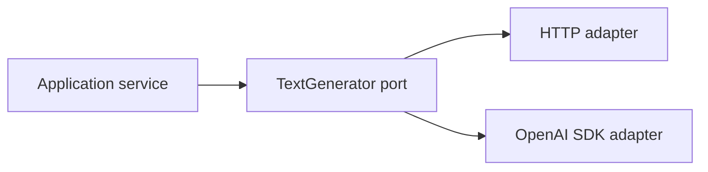

# Day 4 — Core Java Integration: HTTP, SDKs, Resilience, and Provider Boundaries

## Outcomes

Learners can compare raw HTTP and official SDK integration, design a provider-neutral port, map errors, protect secrets, and specify retry/timeout/idempotency behavior.

## 1. Two Core Java integration choices

| Choice | Advantage | Cost |
| --- | --- | --- |
| Java `HttpClient` | protocol visibility and minimal provider dependency | manual JSON, events, errors, upgrades |
| Official provider SDK | typed requests/responses and provider feature coverage | provider types and release cadence |

Use one clear boundary. Domain code should not care whether Java `HttpClient` or an SDK performs the call.

## 2. Ports and adapters



Only one adapter would normally be active for a capability in a deployment. Explicit construction chooses it.

```java
// Boundary sketch
interface TextGenerator {
    GenerationResult generate(GenerationRequest request);
}

final class OpenAiSdkTextGenerator implements TextGenerator {
    private final OpenAIClient client;
    private final RequestMapper requestMapper;
    private final ResponseMapper responseMapper;
}
```

Provider types stop at the adapter. The application port speaks in use-case terms.

## 3. HTTP anatomy

A model API request typically contains:

- authenticated HTTPS endpoint;
- headers including content type and bearer credentials;
- model/capability selection;
- input/messages and optional structured-output/tool definitions;
- limits or provider-supported parameters;
- correlation/request metadata allowed by policy.

```java
// Concept fragment: body construction and surrounding error handling omitted
HttpRequest request = HttpRequest.newBuilder(endpoint)
        .timeout(remainingBudget)
        .header("Authorization", "Bearer " + apiKey)
        .header("Content-Type", "application/json")
        .POST(HttpRequest.BodyPublishers.ofString(serializedBody))
        .build();
```

Never log this request object or credential. A secret should come from environment/secret management, not source code, Maven properties, or committed YAML.

## 4. Official OpenAI Java SDK concept

The official Java library uses the Responses API as its primary generation surface. Treat the following as a dependency-shape reference, not a complete call:

```java
// Concept fragment
OpenAIClient client = OpenAIOkHttpClient.fromEnv();
ResponseCreateParams params = ResponseCreateParams.builder()
        .input(promptEnvelope.renderedInput())
        .model(configuredModel)
        .build();
Response providerResponse = client.responses().create(params);
```

Do not copy a model constant from training slides into production code without verifying current availability and account access.

## 5. Error taxonomy

```java
// Concept fragment
sealed interface ProviderFailure permits
        InvalidRequest, AuthenticationFailure, RateLimited,
        ProviderUnavailable, TimedOut, ProtocolFailure { }
```

Suggested decisions:

| Failure | Retry? | Application response |
| --- | --- | --- |
| invalid input/schema | no | correct request or return 4xx |
| bad credential | no automatic retry | alert/configuration failure |
| rate limited | bounded, respect provider guidance | degrade or 429/503 |
| transient 5xx | bounded with backoff/jitter | fallback if budget remains |
| timeout | sometimes, only if safe and budget remains | timeout/degraded response |
| invalid generated output | repair at most deliberately; then fail safely | validation failure |

## 6. Timeout budget

Use a total deadline, not independent large timeouts for retrieval, model call, validation, and tools.

```text
2,500 ms request budget
  150 ms validation/auth
  350 ms retrieval
1,600 ms model call
  200 ms output validation
  200 ms response/network reserve
```

A retry must fit inside the remaining budget.

## 7. Retry rules

- retry only classified transient failures;
- use exponential backoff with jitter;
- cap attempts and total time;
- honor provider rate-limit guidance when available;
- never retry a side effect unless idempotency is designed;
- emit metrics for initial failure and final outcome;
- avoid retry multiplication across HTTP client, SDK, proxy, and gateway layers.

## 8. Output mapping

Provider response objects often contain content items, usage, status, IDs, and warnings. The mapper should:

- extract the intended output variant;
- reject missing/unexpected variants;
- preserve provider request ID for operations;
- translate usage into neutral metrics;
- validate structure before creating a domain result;
- avoid returning raw provider objects from controllers.

## 9. Testing without a model

The port supports deterministic tests:

```java
// Concept fragment
final class StubTextGenerator implements TextGenerator {
    private final GenerationResult nextResult;
    // generate(...) returns the configured result; call capture omitted
}
```

Test application decisions with stubs. Use separately controlled integration/contract tests for provider mappings.

## Recap

Core Java integration is a boundary-design problem. HTTP or SDK syntax is secondary to secrets, time budgets, error classification, output validation, and provider isolation.
