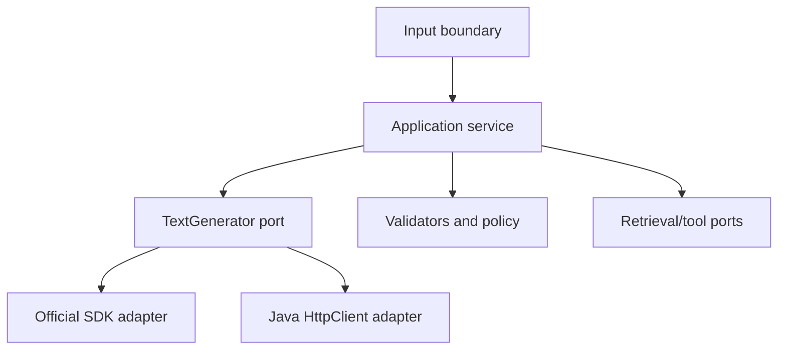

# Day 5 — Core Java GenAI Application Architecture

## Outcomes

Learners can structure a GenAI application using plain Java packages, interfaces, records, services, adapters, configuration objects, and an explicit composition root. They can explain every collaboration without annotations or a container.

## 1. Why architecture still matters

An API call may take a few lines, but the application must also authenticate its caller, validate input, assemble prompts, retrieve evidence, classify failures, enforce policy, validate output, record metrics, and degrade safely. These responsibilities should not collect inside a single `main` method or provider client wrapper.



The diagram is a responsibility map. Only one generation adapter normally serves a capability in a deployment.

## 2. Package design

```text
com.example.assistant
├── boundary          # CLI, HTTP-handler, batch, or message DTO mapping
├── application       # commands, use cases, orchestration, result types
├── domain            # value objects, policy and validation concepts
├── infrastructure
│   ├── openai        # official SDK client adapter and mappers
│   ├── http          # optional java.net.http adapter and JSON mapping
│   ├── retrieval     # search/vector/document implementations
│   └── observability # metrics, audit and tracing implementations
└── bootstrap         # configuration loading and object composition
```

Package direction matters more than folder names: domain/application code must not import provider SDK types.

## 3. Application-owned contracts

```java
// Concept fragment
record AnswerQuestionCommand(
        String question,
        UserContext userContext,
        RequestBudget budget) {
}

interface AnswerQuestion {
    AnswerResult answer(AnswerQuestionCommand command);
}
```

The boundary maps external input into a command. It does not concatenate prompts or inspect provider exceptions.

```java
// Boundary sketch
final class DefaultAnswerQuestion implements AnswerQuestion {
    private final InputPolicy inputPolicy;
    private final EvidenceRetriever retriever;
    private final PromptAssembler promptAssembler;
    private final TextGenerator generator;
    private final AnswerValidator answerValidator;
}
```

The fields reveal the use-case sequence. Constructor validation and method implementation are deliberately omitted.

## 4. Composition root

A composition root is the single place that builds the object graph. It is an explicit alternative to a dependency-injection container.

```java
// Boundary sketch — incomplete by design
final class ApplicationBootstrap {
    AnswerQuestion build(ApplicationConfiguration config) {
        TextGenerator generator = createConfiguredGenerator(config.modelProfile());
        EvidenceRetriever retriever = createRetriever(config.knowledgeProfile());
        return new DefaultAnswerQuestion(
                createInputPolicy(config),
                retriever,
                createPromptAssembler(config.promptVersion()),
                generator,
                createAnswerValidator(config));
    }
}
```

The bootstrap may know concrete classes. Application services know interfaces. Avoid a global service locator that hides dependencies at call sites.

## 5. Configuration as validated data

```java
// Concept fragment
record ModelClientConfiguration(
        URI endpoint,
        String modelProfile,
        Duration connectTimeout,
        Duration requestTimeout,
        int maximumAttempts,
        int maximumConcurrentRequests) {
}
```

Load values from environment, system properties, or an approved external source, then validate once. Keep the secret in a narrow credential provider; do not include it in `toString`, logs, records used for metrics, or exception messages.

## 6. Boundary options without a web framework

The course does not create a server, but learners should see that the same application service can be called by:

- a command-line handler;
- a Java `HttpServer`/Servlet/Jakarta-independent adapter;
- a scheduled batch;
- a message consumer;
- a unit test or evaluation runner.

Each boundary translates protocol-specific input/output. None owns prompt or provider logic.

## 7. DTO mapping

```java
// Concept fragment
record QuestionInput(String question) { }
record AnswerOutput(String status, String answer, List<CitationOutput> citations) { }

final class AnswerBoundaryMapper {
    AnswerQuestionCommand toCommand(QuestionInput input, TrustedCaller caller) {
        // Map validated boundary data and trusted identity.
        throw new UnsupportedOperationException("reference fragment");
    }
}
```

The deliberate exception prevents the fragment from becoming a runnable example. Identity must come from a trusted boundary, not a user-supplied JSON field.

## 8. Result mapping

```java
// Concept fragment
sealed interface AnswerResult permits
        Answered, NoEvidence, Rejected, TemporarilyUnavailable, InvalidModelOutput { }
```

A CLI boundary may map results to text and exit codes; an HTTP boundary may map them to statuses; a batch may persist them. The application result remains protocol-neutral.

## 9. Cross-cutting decorators

```java
// Boundary sketch
final class MeteredTextGenerator implements TextGenerator {
    private final TextGenerator delegate;
    private final GenerationMetrics metrics;
}

final class RateLimitedTextGenerator implements TextGenerator {
    private final TextGenerator delegate;
    private final ConcurrencyLimiter limiter;
}
```

Decorators can add metrics, rate limits, caching, retries, or policy while preserving one port. Order is behavior: retry outside metrics differs from metrics outside retry. Document and test the chain.

## 10. Concurrency ownership

```java
// Concept fragment
try (var executor = Executors.newVirtualThreadPerTaskExecutor()) {
    // Acquire a bounded permit before submitting provider work.
    // Propagate the remaining deadline and cancel abandoned work.
}
```

Virtual threads make blocking tasks cheaper, not unlimited. The composition must include bounded concurrency, total deadlines, cancellation, quota/rate control, and retry ownership.

## 11. Testing layers

- domain: deterministic value/policy tests;
- application: use fake ports and verify orchestration/result decisions;
- boundary: verify external DTO and status/exit mapping;
- provider adapter: map controlled request/response/error fixtures;
- evaluation: score representative semantic behavior separately;
- live smoke/contract checks: limited and explicitly invoked in a real project, not part of this repository.

## 12. Anti-pattern review

```java
// Anti-pattern
class Assistant {
    static String KEY = "...";
    String ask(String input) {
        // build JSON, call provider, retry forever, print and return raw text
        return "";
    }
}
```

Problems: secret in code, no typed contract, mixed responsibilities, no deadline, no validation, hidden retry, no provider isolation, no metrics, and no safe failure.

## Recap

Core Java is sufficient to teach the important architecture: explicit dependencies, application-owned contracts, provider adapters, validated configuration, typed outcomes, decorators, and testable orchestration.

