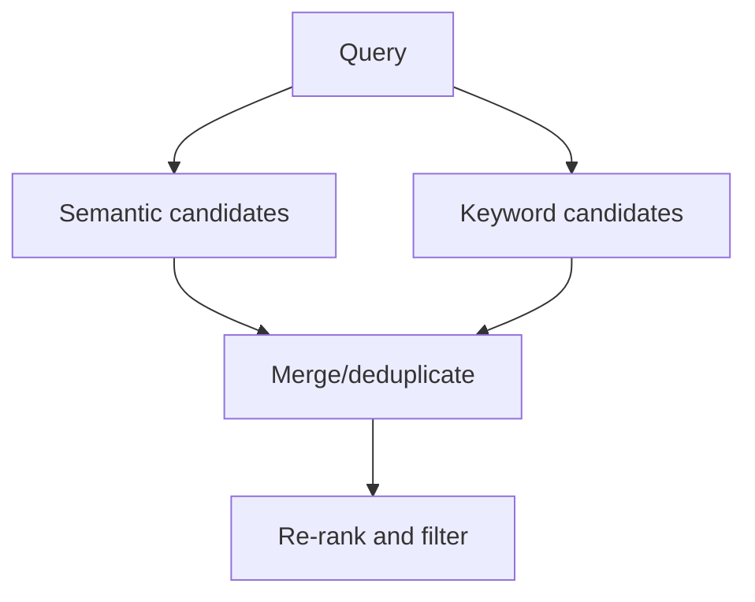

# Day 6 — Embeddings, Chunking, and Semantic Search

## Outcomes

Learners can explain embeddings and similarity, design chunk metadata, compare chunking strategies, define a vector-store port, and evaluate retrieval independently from generation.

## 1. From content to vectors


At query time, the application embeds the query using a compatible model and asks the index for nearby vectors subject to metadata filters.

## 2. Similarity intuition

Cosine similarity compares vector direction:

$$\operatorname{cosine}(a,b)=\frac{a\cdot b}{\|a\|\|b\|}$$

A larger score means “closer under this representation and metric,” not “factually answers the question.” Thresholds must be tuned on a domain dataset.

## 3. Chunk contract

```java
// Concept fragment
record KnowledgeChunk(
        String chunkId,
        String documentId,
        String version,
        String section,
        String text,
        SecurityLabel securityLabel,
        String tenantId,
        Instant effectiveFrom,
        Instant effectiveTo) {
}
```

Metadata enables filtering, citations, deletion, re-indexing, access control, and freshness checks. A vector without source identity is difficult to govern.

## 4. Chunking strategies

| Strategy | Strength | Risk |
| --- | --- | --- |
| Fixed size | simple and predictable | splits semantic units |
| Paragraph/heading | preserves document structure | very uneven sizes |
| Recursive separators | balances size and structure | requires tuning |
| Semantic chunking | adapts to topic shifts | extra complexity/cost |
| Domain-aware | respects policy clauses, methods, FAQs | parser maintenance |

Overlap can preserve boundary context but increases storage and duplicate retrieval. Choose with evaluation, not preference.

## 5. Vector-store port

```java
// Boundary sketch
interface SemanticIndex {
    void upsert(List<EmbeddedChunk> chunks);
    List<SearchHit> search(QueryVector query, SearchFilter filter, int limit);
    void deleteByDocument(String documentId, String version);
}
```

The port makes required capabilities explicit. A production design must also address batching, failures, consistency, tenant isolation, and re-index migration.

## 6. Hybrid retrieval

Semantic search handles meaning; lexical search handles exact strings, identifiers, names, and rare terms. Hybrid retrieval combines both and may re-rank candidates.



## 7. Access control

Do not retrieve broadly and remove unauthorized chunks after generation. Apply tenant, role, classification, region, and effective-date constraints before or during search. The model must never receive forbidden evidence.

## 8. Embedding migrations

Changing embedding model or dimension usually requires a new index namespace and re-embedding. A safe migration includes:

- old/new index versions;
- reproducible parsing/chunking version;
- background backfill;
- side-by-side retrieval evaluation;
- cutover and rollback;
- deletion/retention consistency.

## 9. Retrieval evaluation

For each query, maintain expected relevant documents/chunks where feasible. Measure recall@k, precision@k, ranking quality, filter correctness, empty-result rate, latency, and stale/unauthorized retrieval. Inspect false positives and false negatives.

## 10. Common failures

- chunks too large to retrieve precisely;
- chunks too small to retain meaning;
- missing document version/effective date;
- query and documents embedded with incompatible models;
- no lexical path for exact codes;
- similarity threshold copied from another domain;
- top-k increased until context becomes noisy;
- permission filters applied after retrieval.

## Recap

Semantic retrieval is an information-retrieval system with model-generated features. Chunking, metadata, access control, index lifecycle, and evaluation determine whether later RAG can be grounded.

