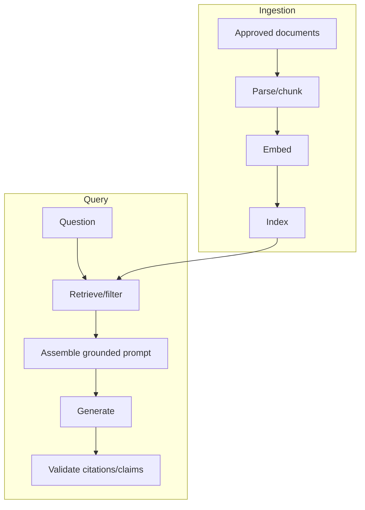

# Day 7 — Retrieval-Augmented Generation (RAG)

## Outcomes

Learners can describe ingestion and query pipelines, build grounded prompt context, distinguish retrieval from generation failures, design citations, and evaluate RAG end to end.

## 1. Why RAG

RAG supplies relevant external evidence at inference time. It is useful for private, current, domain-specific, or citable knowledge. It does not guarantee the retrieved evidence is correct, authorized, sufficient, or followed by the model.

## 2. Two pipelines



Ingestion is a governed data pipeline; query is a latency-sensitive application pipeline.

## 3. Retrieval contract

```java
// Boundary sketch
interface EvidenceRetriever {
    RetrievalResult retrieve(Question question, AccessScope scope, RetrievalBudget budget);
}

record GroundingChunk(String citationId, String text, SourceRef source, double score) { }
```

Only authorized, version-valid evidence should become `GroundingChunk` objects.

## 4. Prompt assembly

The grounded prompt should:

- state that evidence is untrusted data, not instructions;
- assign stable citation IDs;
- instruct the model to use only supplied evidence for factual claims;
- define insufficient-evidence behavior;
- avoid passing metadata the model does not need;
- fit a controlled token budget;
- preserve the original user question separately.

## 5. Citation design

The model may return citation IDs, but Java verifies that:

- each ID was in this request’s evidence;
- cited text supports the claim;
- the source is still available and authorized;
- displayed link/title comes from trusted metadata, not generated text;
- claims requiring evidence have citations.

Do not let the model invent URLs.

## 6. RAG result types

```java
// Concept fragment
sealed interface RagResult permits
        GroundedAnswer, NoEvidence, AmbiguousEvidence,
        RetrievalUnavailable, InvalidCitation, UnsafeOutput { }
```

This separates “model could not answer” from “retrieval had no authorized evidence” and “answer failed validation.”

## 7. Query transformation

Possible steps include typo correction, acronym expansion, conversation-aware rewriting, multi-query generation, and decomposition. Each can improve recall but can also change user intent. Retain the original query and evaluate transformations.

## 8. Re-ranking and compression

Re-ranking orders candidates using a more precise method. Contextual compression selects relevant portions from longer chunks. Both reduce noise but add latency, cost, and another failure point. Use them when retrieval evaluation shows a problem they solve.

## 9. RAG failure matrix

| Stage | Failure | Control |
| --- | --- | --- |
| ingestion | stale or malformed source | versioning, validation, quarantine |
| chunking | answer spans bad boundary | domain structure/overlap evaluation |
| embedding | model mismatch | versioned index |
| filtering | unauthorized retrieval | pre-retrieval access constraints |
| ranking | relevant chunk below top-k | hybrid search/re-ranking |
| assembly | context truncated | explicit token budgeting |
| generation | ignores evidence | prompt + grounding evaluation |
| citation | invented/unsupported ID | server-side citation validation |

## 10. RAG evaluation layers

- Retrieval: did relevant authorized evidence appear in top-k?
- Context: was evidence sufficient and non-conflicting?
- Generation: are claims entailed by evidence?
- Citation: do citations point to supporting sources?
- End-to-end: is the answer useful, safe, timely, and cost-acceptable?

## 11. Core Java mapping

Express the pipeline as ports such as `DocumentLoader`, `Chunker`, `EmbeddingClient`, `SemanticIndex`, `EvidenceRetriever`, and `PromptAssembler`. Concrete SDK, HTTP, parser, and store types remain in adapters. Document decorator order, filters, query transformations, context format, and failure behavior.

## Recap

RAG is not “vector database + prompt.” It is a governed ingestion system and a controlled query pipeline whose retrieval, grounding, citation, security, and evaluation concerns are independently visible.
