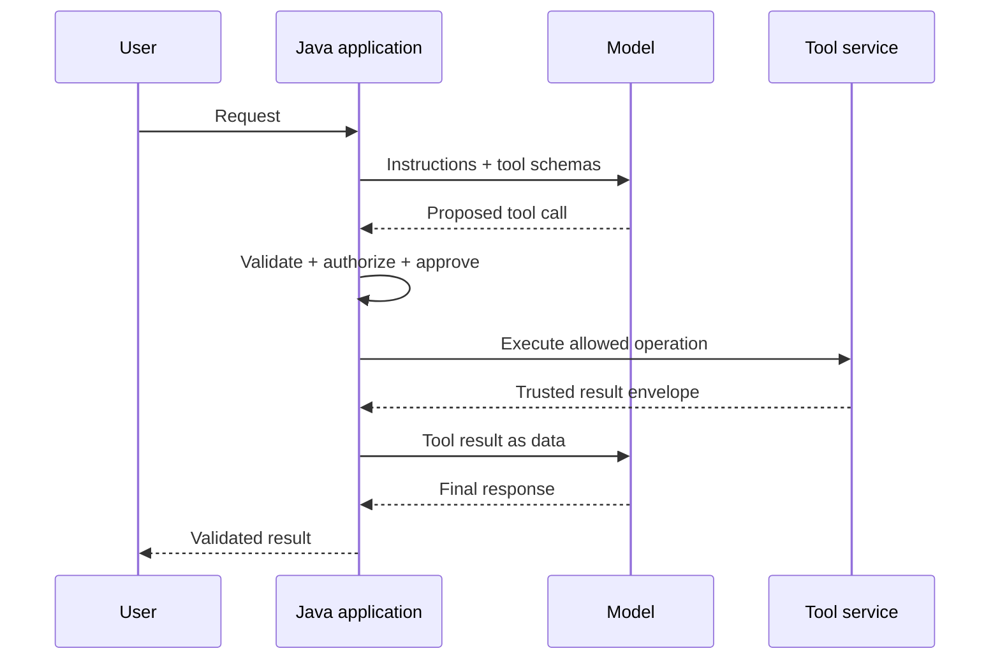
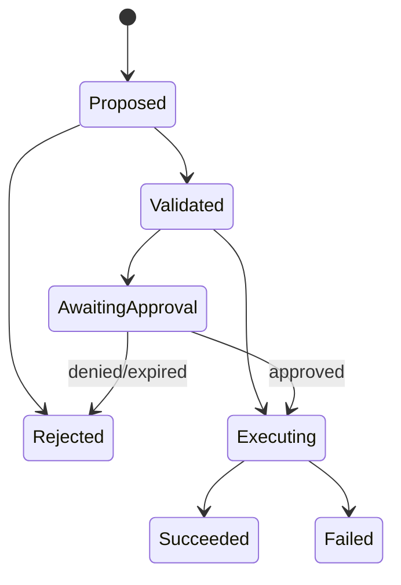

# Day 8 — Tool Calling and Bounded Agentic Workflows

## Outcomes

Learners can distinguish tool calling from execution, define safe Java tool contracts, model workflow state, enforce approval/idempotency, and decide when not to use an agent.

## 1. Model proposes; application disposes

A model can select a tool name and propose arguments. Trusted Java code validates schema, authorization, policy, current state, and idempotency before deciding whether execution is allowed.



## 2. Tool contract

```java
// Concept fragment
record ToolDefinition(
        String name,
        String purpose,
        JsonSchema inputSchema,
        SideEffectLevel sideEffectLevel,
        ApprovalPolicy approvalPolicy) {
}

interface Tool<I, O> {
    O execute(I validatedInput, ExecutionContext context);
}
```

The model never supplies `ExecutionContext`; Java creates it from authenticated identity, tenant, permissions, deadline, and audit correlation.

## 3. Read versus write tools

| Tool | Risk posture |
| --- | --- |
| search approved catalog | read-only, filtered, bounded |
| retrieve order status | read-only but contains sensitive data |
| draft email | generation only; sending is separate |
| send email | side effect; recipient resolution and approval required |
| update employee record | high-impact write; strong authorization and validation |
| delete resource | destructive; normally human confirmation and recovery plan |

Keep proposal and execution as separate states.

## 4. State machine



Persist state for side effects. Do not rely on conversation history as the system of record.

## 5. Idempotency

Retries or repeated model proposals can duplicate actions. For a side-effecting tool:

- derive/store an idempotency key from the approved action;
- check current state before execution;
- make success safely repeatable or detectable;
- record provider/external transaction identity;
- never treat generated text as the idempotency key without normalization and trust.

## 6. Agent versus workflow

Use deterministic workflow code when steps and conditions are known. Use model-driven choice only where language interpretation or flexible selection adds measurable value.

```java
// Concept fragment
sealed interface WorkflowStep permits
        ClassifyIntent, RetrieveEvidence, ProposeAction,
        AwaitHumanApproval, ExecuteAction, ProduceResponse { }
```

A bounded state machine is easier to test and audit than an open-ended loop.

## 7. Budgets and termination

Set maximum:

- model turns;
- tool calls;
- wall-clock duration;
- input/output tokens;
- cost;
- repeated identical actions;
- consecutive failures.

Terminate on success, explicit inability, policy denial, deadline, budget exhaustion, or repeated non-progress.

## 8. Java 21 concurrency

Independent read-only tools may run concurrently using virtual threads if the business semantics permit. Apply concurrency limits, per-tool deadlines, cancellation, and deterministic merge behavior. Never parallelize dependent or conflicting side effects for speed.

## 9. Tool-result injection

Tool output is also untrusted data. A web page, ticket description, or database text may contain instructions. Pass results in a data channel/structure and remind the model not to treat embedded instructions as application policy.

## 10. Core Java mapping

Represent tool definitions, proposed calls, validated arguments, execution context, approval and results as application-owned records/interfaces. A provider adapter translates provider tool-call variants into `ProposedToolCall`; a registry resolves only allow-listed tools. Registration is not a security review.

## Recap

Tool calling is a proposal protocol. Safe agentic systems are bounded workflows where Java retains identity, policy, state, authorization, approval, execution, and audit.
