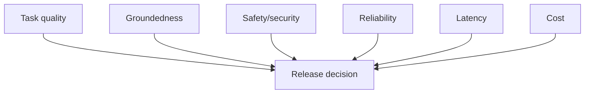

# Day 9 — Safety, Evaluation, Observability, Cost, and Performance

## Outcomes

Learners can threat-model a GenAI request, design layered guardrails, build evaluation datasets/metrics, define privacy-aware telemetry, and reason about latency/cost trade-offs.

## 1. Quality is multi-dimensional

A fluent answer can be wrong, unsafe, ungrounded, too slow, too costly, or structurally unusable. Production readiness needs an acceptance envelope:



No single score is enough for critical behavior.

## 2. Defense in depth

Controls can exist at:

- caller authentication and authorization;
- input type/size and sensitive-data detection;
- source approval and access-filtered retrieval;
- prompt/message construction;
- provider safety capabilities;
- schema and semantic output validation;
- citation/grounding verification;
- tool allow-list and approval;
- UI disclosure and human review;
- monitoring, incident response, and kill switches.

Avoid one “guardrail service” that creates a false sense of complete protection.

## 3. Threat model

| Threat | Example | Primary controls |
| --- | --- | --- |
| prompt injection | document tells model to reveal secrets | treat data as untrusted, minimize accessible secrets/tools |
| sensitive-data leakage | prompt includes employee medical data | minimization, classification, redaction, provider policy |
| insecure output handling | generated HTML/SQL rendered/executed | context-aware encoding, parameterization, no execution |
| excessive agency | model can close accounts | least-privilege tools, approval, budgets |
| cross-tenant retrieval | wrong tenant chunk is retrieved | pre-retrieval filters and tests |
| denial of wallet | huge/recursive calls consume quota | size, rate, step, token and cost limits |
| supply-chain risk | compromised dependency | dependency governance and scanning |

## 4. Evaluation dataset

```java
// Concept fragment
record EvaluationCase(
        String id,
        String category,
        String input,
        List<String> expectedSourceIds,
        ExpectedBehavior expected,
        Severity severity) {
}
```

Avoid putting real secrets or unnecessary personal data in evaluation fixtures. Version the dataset and review its representativeness.

## 5. Deterministic and rubric checks

Deterministic checks:

- JSON parses and matches schema;
- required fields and ranges are valid;
- citations are drawn from retrieved IDs;
- refusal status matches field rules;
- output length and prohibited patterns;
- latency/cost limits.

Rubric checks:

- relevance and completeness;
- groundedness/entailment;
- clarity for the audience;
- harmful or biased content;
- faithfulness to instructions.

Human scoring is valuable but expensive. Model-based scoring scales, yet must be calibrated and audited.

## 6. Retrieval and generation metrics

Do not hide retrieval failures inside a final “answer quality” score.

| Layer | Metrics |
| --- | --- |
| retrieval | recall@k, precision@k, ranking, filter violations |
| prompt/format | schema-valid rate, instruction adherence |
| answer | groundedness, citation correctness, task rubric |
| safety | critical violation count, refusal precision/recall |
| operation | availability, timeout, retry, latency percentiles, tokens/cost |

## 7. Observability

Capture metadata that supports diagnosis without collecting unnecessary content:

```java
// Concept fragment
record GenerationObservation(
        String correlationId,
        String useCase,
        String promptVersion,
        String modelProfile,
        String retrievalVersion,
        long latencyMillis,
        Usage usage,
        String outcomeCategory) {
}
```

Do not use raw user input or email address as a correlation ID. Logs, metrics, and traces have different purposes.

## 8. Latency model

$$T_{total}=T_{queue}+T_{retrieval}+T_{model}+T_{tools}+T_{validation}+T_{network}$$

Track p50, p95, and p99. An average can hide poor tail latency. For streaming, also track time-to-first-token and completion/cancellation.

## 9. Cost model

Approximate per-task cost includes model input/output, embeddings, vector/search, re-ranking, tool/API calls, and infrastructure. Optimize cost per **successful accepted task**, not cheapest model call.

Cost controls:

- concise, stable instructions;
- relevant rather than maximal context;
- output limits;
- caching only where privacy/freshness allow;
- smaller model profile for simpler tasks after evaluation;
- stop useless retries/agent loops;
- monitor by use case and tenant.

## 10. Release gate

```java
// Concept fragment
record ReleaseGate(
        double minimumGroundedness,
        double minimumTaskScore,
        int maximumCriticalSafetyFailures,
        Duration maximumP95Latency,
        BigDecimal maximumCostPerAcceptedTask) {
}
```

A release should fail if any critical threshold fails, even when the aggregate score improves.

## 11. Incident examples

- sudden schema-invalid rate: inspect prompt/model/dependency version changes;
- rising no-evidence rate: inspect source ingestion and filter changes;
- token increase: inspect prompt, advisor, conversation memory, top-k;
- repeated tool calls: stop workflow, inspect termination/idempotency;
- cross-tenant evidence: disable affected path and treat as security incident.

## Recap

Evaluation turns “seems good” into evidence. Observability makes behavior diagnosable. Safety, latency, cost, and quality are release requirements with explicit thresholds.

