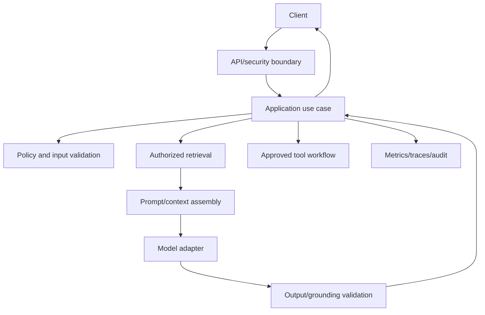

# Day 10 — Production Architecture, Capstone, and Interview Readiness

## Outcomes

Learners can synthesize the course into a production-oriented architecture, justify Core Java/Maven/provider decisions, explain failure behavior, defend evaluation gates, and answer system-design questions.

## 1. Reference architecture



This is not a mandatory microservice decomposition. It is a responsibility map. Start as a well-structured Core Java application unless scale, ownership, isolation, or deployment constraints justify distribution.

## 2. Package blueprint

```text
com.example.assistant
├── api                 # controllers, HTTP DTOs, exception mapping
├── application         # use cases, commands, result types, orchestration
├── domain              # policies, value objects, validation concepts
├── infrastructure
│   ├── ai              # OpenAI SDK/HTTP adapter and mappers
│   ├── retrieval       # vector/search adapters
│   ├── tools           # external operation adapters
│   └── observability   # metrics/tracing/audit adapters
├── bootstrap           # configuration loading and explicit object composition
└── evaluation          # datasets, scorers, release-gate support
```

## 3. Architecture decision records

Each major decision should capture context, decision, alternatives, consequences, and review trigger. Recommended ADRs:

- direct Java HTTP versus official SDK;
- Core Java modular application versus separate services;
- RAG versus prompt-only/fine-tuning;
- vector store and hybrid retrieval;
- synchronous versus streaming;
- tool autonomy and approval;
- model/capability routing;
- prompt and evaluation versioning;
- content logging policy.

## 4. Production readiness questions

### Functional

- What exact task is supported?
- What is the fallback when evidence is missing?
- Which outputs are advisory versus authoritative?

### Data and security

- Which data crosses provider boundaries?
- How is tenant/source access enforced before retrieval?
- Where are secrets and audit trails stored?

### Reliability

- What is the total deadline and retry ownership?
- What happens during provider or vector-store outage?
- Are side effects idempotent and approval-bound?

### Quality

- Which dataset and thresholds gate release?
- How are prompt/model/index versions correlated?
- Who reviews critical failures?

### Operations

- What are p95 latency and cost budgets?
- Which metrics alert, and who responds?
- Can risky tools or the model path be disabled quickly?

## 5. Model routing

Avoid scattering model names through code. Configure a capability profile:

```java
// Concept fragment
record ModelProfile(
        String profileName,
        Set<Capability> requiredCapabilities,
        Duration timeout,
        int maximumOutputTokens,
        DataPolicy dataPolicy) {
}
```

Infrastructure resolves a provider/model that satisfies the reviewed profile. Changes require evaluation, not just configuration deployment.

## 6. Degradation strategy

Possible degraded modes:

- return source search results without generated synthesis;
- accept a drafting job asynchronously;
- use an evaluated alternate provider/profile;
- provide cached static guidance when freshness permits;
- disable side-effecting tools but retain read-only assistance;
- return a transparent temporary-unavailability response.

Never silently answer from unsupported model memory when RAG is unavailable.

## 7. Capstone presentation structure

1. user problem and non-goals;
2. system context and trust boundaries;
3. request sequence and failure outcomes;
4. Core Java package, composition-root and port/adapter design;
5. prompt and output contract;
6. RAG/tool decision;
7. safety/privacy controls;
8. evaluation and release gate;
9. latency/cost/reliability plan;
10. two rejected alternatives and why.

## 8. Design-review anti-patterns

- “The model will check” for authorization or correctness;
- controller-to-provider coupling;
- unversioned prompts/indexes;
- unrestricted conversation memory;
- vector search without metadata/access filters;
- agent loop without budgets/termination;
- generated tool arguments executed directly;
- averages without critical-case gates;
- every test calls the live provider;
- component diagram that omits users, data, failures, and operations.

## 9. Interview answer method

For system-design questions use:

1. clarify the user and harm level;
2. state deterministic versus model responsibilities;
3. draw request/data flow;
4. define contracts and failure states;
5. cover security, evaluation, latency, cost, and observability;
6. compare alternatives and name a review trigger.

## 10. Final reflection

A junior developer is production-ready in this domain when they stop treating the model call as the application. The application is the system of contracts, evidence, policies, controls, evaluation, and operations around that call.
