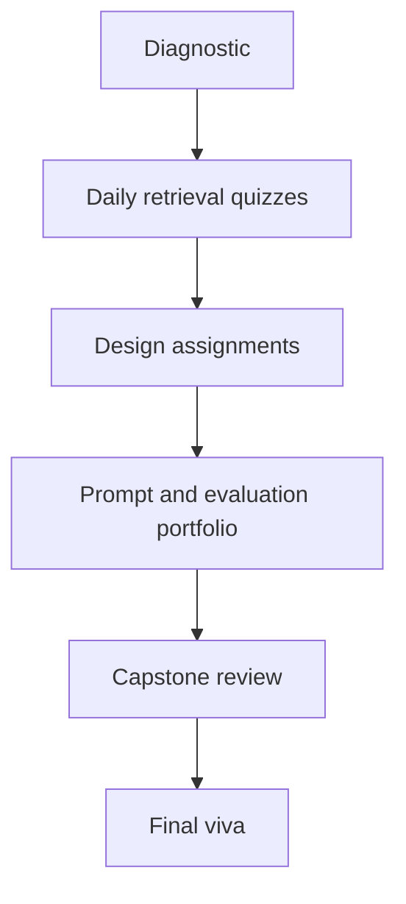

# Assessment Strategy

## Assessment architecture

## Evidence types

| Evidence | What it measures | Typical scoring method |
| --- | --- | --- |
| Short answer | terminology and conceptual accuracy | answer key with required points |
| Snippet review | Core Java and API-boundary reasoning | defect identification + correction rationale |
| Diagram | component and data-flow understanding | completeness, boundaries, failure paths |
| Prompt specification | instruction and output-contract quality | prompt rubric |
| Evaluation plan | ability to define measurable quality | dataset, metric, threshold, process |
| Viva | ownership of decisions | structured oral questions |

## Daily assignment rubric (20 points)

| Criterion | Points |
| --- | ---: |
| Conceptual correctness | 5 |
| Core Java design clarity | 4 |
| Failure and edge cases | 3 |
| Security/privacy/safety | 3 |
| Evaluation or acceptance criteria | 3 |
| Communication and diagram quality | 2 |

## Prompt specification rubric (20 points)

- task and audience are explicit — 3
- authoritative context is separated from instructions — 3
- constraints and refusal/fallback behavior are stated — 3
- expected output contract is machine-checkable — 4
- examples represent normal and edge cases — 3
- prompt-injection and untrusted-data treatment is visible — 2
- version and evaluation notes are present — 2

## Pass conditions

Recommended pass mark: 60%, with both conditions below:

- at least 50% in the capstone component;
- no critical misunderstanding involving secrets, authorization, untrusted model output, or destructive tool execution.

## Remediation

Learners below threshold should complete one targeted redesign:

- weak fundamentals: explain an end-to-end request using the Day 2 diagram;
- weak Java design: refactor a provider-coupled controller into ports and adapters;
- weak RAG: add source-aware retrieval and a grounded fallback;
- weak safety: produce a threat model and human-approval path;
- weak evaluation: build a 15-case test set with explicit scoring rules.
