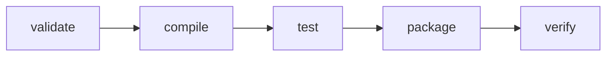

# Maven Reference for Core Java GenAI Learning

## What Maven contributes

Maven gives a Java project a repeatable model for compilation, dependencies, tests, packaging, plugins, and dependency analysis. It is not an AI framework and cannot make probabilistic model output deterministic.

## Lifecycle mental model



`verify` includes earlier phases. A successful package does not prove that semantic evaluation, provider availability, privacy review, or production quality gates passed.

## Configuration excerpt — Java 21

```xml
<!-- Configuration excerpt: not a complete POM -->
<properties>
    <maven.compiler.release>21</maven.compiler.release>
    <project.build.sourceEncoding>UTF-8</project.build.sourceEncoding>
</properties>
```

The `release` property constrains language level, bytecode target, and Java API availability more reliably than setting only `source` and `target`.

## Configuration excerpt — provider SDK

```xml
<!-- Optional concrete provider adapter; version is a dated reference -->
<dependency>
    <groupId>com.openai</groupId>
    <artifactId>openai-java</artifactId>
    <version>${openai-java.version}</version>
</dependency>
```

The dependency belongs to the infrastructure adapter. Domain and application packages should not import its types.

## Configuration excerpt — testing roles

```xml
<!-- Representative fragments only -->
<dependency>
    <groupId>org.junit.jupiter</groupId>
    <artifactId>junit-jupiter</artifactId>
    <scope>test</scope>
</dependency>
```

Normal unit tests use deterministic fakes. A separate, explicitly selected profile may own provider contract checks in a real project; this repository contains no executable profile or test suite.

## Suggested conceptual modules

```text
genai-domain          # provider-free records, policies and result types
genai-application     # use cases, ports and orchestration
genai-openai-adapter  # optional official-SDK mapping
genai-http-adapter    # optional Java HttpClient mapping
genai-evaluation      # datasets, scorers and reports
```

This is a design sketch, not a multi-module project. A simple single-module codebase with equivalent packages may be preferable for freshers.

## Dependency decision record

For each dependency ask:

- What responsibility requires it?
- Which package is allowed to import it?
- Who controls the version?
- What data can it transmit or log?
- Does it retry or create threads internally?
- How is it patched and evaluated after an upgrade?
- What replaces it if the provider changes?

## Anti-patterns

- importing provider DTOs in domain records;
- relying on an undeclared transitive dependency;
- dynamic version ranges;
- credentials in `pom.xml`, profiles, or filtered resources;
- both HTTP and SDK clients active without a single owning adapter;
- treating `mvn verify` as semantic model evaluation;
- adding a framework solely to hide object construction.

