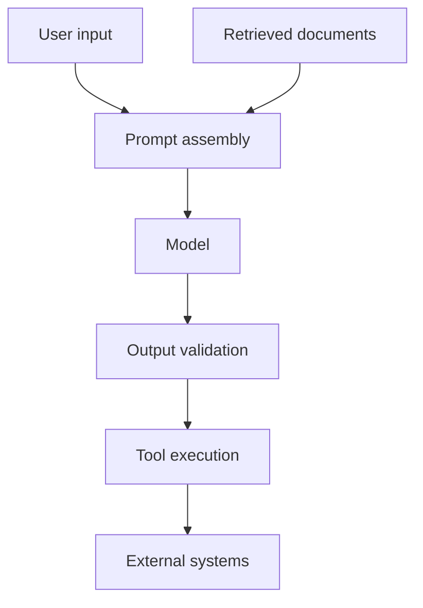

# Safety and Security Checklist

## Threat surfaces

Every arrow crossing into another component is a trust boundary.

## Input and context

- [ ] authenticate the caller where required;
- [ ] authorize the use case independently of the prompt;
- [ ] limit input size and supported content types;
- [ ] detect or redact prohibited sensitive data;
- [ ] treat retrieved text, web pages, and tool results as untrusted;
- [ ] separate instructions from data using structured message roles and delimiters;
- [ ] attach source, tenant, classification, and retention metadata to chunks;
- [ ] prevent cross-tenant retrieval.

## Model request

- [ ] load secrets from an approved secret store or environment injection;
- [ ] never send more data than the task needs;
- [ ] choose provider data-retention settings according to policy;
- [ ] set timeouts and output limits;
- [ ] use model and capability allow-lists;
- [ ] avoid logging raw prompts by default;
- [ ] attach correlation IDs without exposing personal identifiers.

## Output

- [ ] validate schema and required fields;
- [ ] validate semantic ranges and domain rules;
- [ ] verify citations resolve to retrieved evidence;
- [ ] encode output before inserting into HTML/SQL/shell contexts;
- [ ] never execute generated code or commands by default;
- [ ] display AI-generated status and limitations when relevant;
- [ ] send high-impact results to human review.

## Tools and agents

- [ ] give tools the minimum operation and data scope;
- [ ] use typed argument schemas and server-side validation;
- [ ] re-check authorization at execution time;
- [ ] distinguish read-only and side-effecting tools;
- [ ] require explicit approval for financial, legal, account, or destructive actions;
- [ ] make side-effecting calls idempotent;
- [ ] bound steps, time, tokens, and cost;
- [ ] persist an audit trail of proposal, approval, execution, and result.

## Operational response

- [ ] define provider-outage fallback;
- [ ] rate-limit callers and bound retry;
- [ ] monitor policy violations and unusual tool patterns;
- [ ] rotate exposed credentials immediately;
- [ ] maintain a kill switch for risky tools;
- [ ] rehearse incident handling without real customer data.

